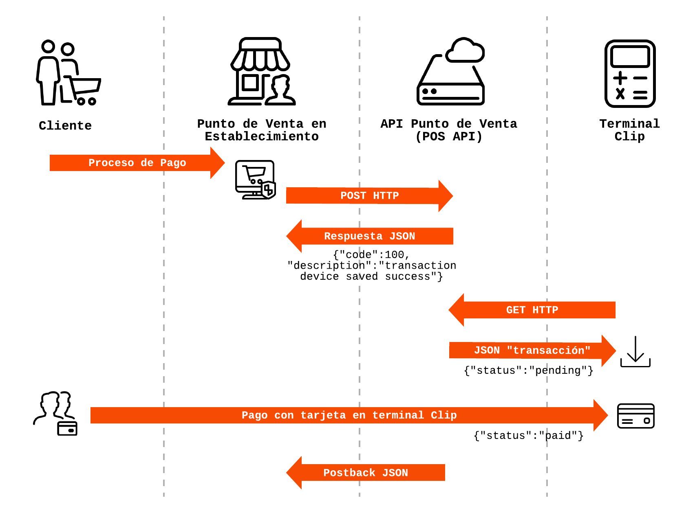

<h1 id="intro">POS API de Clip (v 1.0)</h1>
<p>Contacto: <a href="mailto:devsupport@payclip.com">devsupport@payclip.com</a>.</p>
<h1 id="primeros-pasos">Primeros Pasos</h1>
<div class="h2 mt-0 pb-3">Introducción a la API de Clip Punto de Venta</div>
<p>
La API de Clip de Punto de Venta (POS API, en inglés, Point of Sale) permite a las aplicaciones de punto de venta de terceros abrir la aplicación Clip para procesar pagos de una persona usando el dispositivo terminal de Clip.
</p>
<p>
Las tarifas de procesamiento para transacciones iniciadas con la API Punto de Venta son idénticas a las <a href="https://clip.mx/costos-y-comisiones/">tarifas para transacciones</a> iniciadas directamente desde la aplicación Clip.
</p>
<div class="h2 mt-0 pb-3">¿Qué puedo hacer con la API Punto de Venta de Clip?</div>
<p>
Los desarrolladores pueden usar la API Punto de Venta para crear soluciones personalizadas de punto de venta o cualquier otra aplicación que requiera pagos, sin preocuparse por el cumplimiento de las normativas de la Industria de Pagos con Tarjeta PCI. Por el momento la API Punto de Venta está disponible para el dispositivo Clip Pro.
</p>
<p>
Las acciones disponibles con la API Punto de Venta de Clip son:
</p>
<ul>
<li>
Registrar una transacción en la terminal Clip a través del punto de venta de un tercero.
</li>
<li>
Obtener una lista de transacciones pendientes para poder finalizarlas con la terminal Clip.
</li>
</ul>
<div class="h2 mt-0 pb-3">¿Qué necesito antes de empezar?</div>
<p>
Para poder desarrollar con la API Punto de Venta de Clip se requiere:
</p>
<ul>
<li>
Un <a href="https://clip.mx/productos-clip/clip-pro/">dispositivo Clip Pro</a> con la versión más reciente de la aplicación Clip instalada.
</li>
<li>
Una <a href="https://dashboard.clip.mx/sign_up">cuenta Clip</a> activa (para aceptar pagos con tarjeta).
</li>
<li>
Un token de <a href="intro.def#Autenticación">autenticación</a>.
</li>
<li>
<a href="#ConfigurarDispositivo">Configurar el dispositivo</a> Clip Pro para desplegar las transacciones pendientes.
</li>
</ul>
<h2>Elementos de la API Punto de Venta de Clip</h2>
<p>
La API Punto de Venta de Clip se comunica a través de llamadas y respuestas en formato JSON. Con las llamadas y respuestas de la API Punto de Venta se puede interactuar con los siguientes elementos:
</p>
<ul>
<li>
<strong>Transactions:</strong> Una transacción contiene detalles de un proceso de pago iniciado en el Punto de Venta del comerciante y que se termina en la terminal Clip. Una transacción puede tener el estatus de <strong>pendiente</strong> o <strong>pagado</strong>.
</li>
</ul>
<div class="h2 pb-3">Flujo de procesos de la API Punto de Venta</div>
<p>
Esta sección describe el flujo de interacciones entre el punto de venta, la API de Clip y la terminal Clip Pro.
</p>
<p>
Definiciones:</p>
<ul>
<li>
Usuario: Persona del establecimiento que realiza la venta.
</li>
<li>
Punto de venta: Interfaz de pago perteneciente al establecimiento.
</li>
<li>
Terminal Clip: Dispositivo Clip Pro con el cual se realiza la transacción con la tarjeta del cliente.
</li>
</ul>
<p>
El flujo de procesos de la API Punto de Venta es el siguiente:
</p>
<ol>
<li>
El usuario realiza el proceso de pago mediante el punto de venta.
</li>
<li>
El punto de venta se comunica a través del método <strong>HTTP POST</strong> con la <strong>API Punto de Venta</strong> de Clip.
</li>
<li>
La <strong>API Punto de Venta</strong> de Clip responde al punto de venta con un código de transacción (Ver tabla de respuestas).
</li>
<li>
El punto de venta solicita con el método <strong>HTTP GET</strong>, la información para procesar la transacción en la terminal Clip a la <strong>API Punto de Venta</strong> de Clip.
</li>
<li>
La terminal Clip agrega la transacción a la lista de pendientes con el estado <strong>Pendiente</strong>. La terminal está lista para realizar el proceso de pago.
</li>
<li>
Al finalizar el proceso de pago en la terminal Clip, se cambia el estado de la transacción a <strong>Pagado.</strong>
</li>
</ol>
<p class="pt-5">

</p>
<h2 id="ConfigurarDispositivo">Configurar el dispositivo para mostrar las transacciones.</h2>
<p>Para completar el proceso de pago en la terminal Clip es necesario mostrar en el dispositivo las transacciones con estatus Pendiente iniciadas en el punto de venta.</p>
<p>Para configurar el dispositivo Clip Pro, realiza los siguientes pasos:</p>
<ol>
<li>
Ir al menú de configuración dentro de tu app Clip (símbolo de engranaje).
</li>
<li>
Ir a la sección de Seguridad.
</li>
<li>
Activar la opción “Transacciones B2B”.
</li>
<li>
Regresar al menú principal.
</li>
</ol>
<p>Una vez completados estos 4 pasos, podrás ver las transacciones pendientes en tu dispositivo Clip Pro como se muestra en la siguiente imagen.</p>
<p class="image-grid">


</p>

# Autenticación
<p>
Todas las llamadas de la API Punto de Venta de Clip requieren autenticación. Es necesario obtener un token de autenticación para poder utilizar de forma segura la API Punto de Venta y poder integrar tu solución personalizada.
</p>

<h2 class="icon key gray mb-3" id="apikey">Api Key</h2>
<div class="h2 mt-0 pb-3">¿Cómo obtener mi token de autenticación?</div>
<p>Para obtener un token de autenticación sigue estos pasos:</p>
<ol>
    <li>Insertar proceso de obtención del Token</li>
</ol>
<div class="h2 mt-0 pb-3">¿Cómo utilizar mi token de autenticación?</div>
<p>El token de autenticación se envía como un parámetro de encabezado o “Header” de la llamada a la API.</p>

El siguiente bloque de código muestra un ejemplo de una llamada CURL a la POS API de Clip. El nombre del parámetro es: <span class="tags gray">x-api-key</span>, y se ubica en los parámetros de: <span class="tags purple">header</span>
<table>
<tbody>
<tr>
<td>
<strong>Tipo de esquema de seguridad:</strong>
</td>
<td>
apiKey
</td>
</tr>
<tr>
<td>
<strong>Nombre del parámetro en header:</strong>
</td>
<td>
x-api-key
</td>
</tr>
<tbody>
</table>

<h1 id="pos-api">POS Api v1.0.0</h1>

> Desplácese hacia abajo para ver ejemplos de código, de llamadas y de respuestas. Selecciona un lenguaje de programación de las pestañas en la parte superior o del menú de navegación móvil.

La API de Clip de Punto de Venta (POS API, en inglés, Point of Sale) permite a las aplicaciones de punto de venta de terceros abrir la aplicación Clip para procesar pagos de una persona usando el dispositivo terminal de Clip. 
Los desarrolladores pueden usar la POS API para crear soluciones personalizadas de punto de venta o cualquier otra aplicación que requiera pagos, sin preocuparse por el cumplimiento de las normativas de la Industria de Pagos con Tarjeta PCI. Por el momento la POS API está disponible para el dispositivo Clip Pro.

<div class="docs-note info enviroments">
Estos Son los diferentes ambientes definidos en la API:

<a href="https://testapi-gw.payclip.com">https://testapi-gw.payclip.com</a> Esta es la direccion del servicio en producción.

<a href="https://sandbox.payclip.com">https://sandbox.payclip.com</a> Esta es la direccion del servicio para pruebas (Sandbox).

</div>

<div class="terms">

Email: <a href="mailto:devsupport@payclip.com">Support</a> 
 License: MIT
</div>

<h1 id="pos-api-payment">payment</h1>

## *post*Registrar una transacción

<a id="opIdPayment Request"></a>

> Ejemplos de Código

```go
package main

import (
       "bytes"
       "net/http"
)

func main() {

    headers := map[string][]string{
        "Content-Type": []string{"application/json"},
        "Accept": []string{"application/json"},
        "x-api-key": []string{"API_KEY"},
        
    }

    data := bytes.NewBuffer([]byte{jsonReq})
    req, err := http.NewRequest("POST", "https://testapi-gw.payclip.com/paymentrequest", data)
    req.Header = headers

    client := &http.Client{}
    resp, err := client.Do(req)
    // ...
}

```

```http
POST https://testapi-gw.payclip.com/paymentrequest HTTP/1.1
Host: testapi-gw.payclip.com
Content-Type: application/json
Accept: application/json

```

```javascript
var headers = {
  'Content-Type':'application/json',
  'Accept':'application/json',
  'x-api-key':'API_KEY'

};

$.ajax({
  url: 'https://testapi-gw.payclip.com/paymentrequest',
  method: 'post',

  headers: headers,
  success: function(data) {
    console.log(JSON.stringify(data));
  }
})

```

```javascript--nodejs
const fetch = require('node-fetch');
const inputBody = '{
  "amount": 0,
  "assigned_user": "user@example.com",
  "reference": "string",
  "user_id": "string",
  "message": "pago pendiente"
}';
const headers = {
  'Content-Type':'application/json',
  'Accept':'application/json',
  'x-api-key':'API_KEY'

};

fetch('https://testapi-gw.payclip.com/paymentrequest',
{
  method: 'POST',
  body: inputBody,
  headers: headers
})
.then(function(res) {
    return res.json();
}).then(function(body) {
    console.log(body);
});

```

```python
import requests
headers = {
  'Content-Type': 'application/json',
  'Accept': 'application/json',
  'x-api-key': 'API_KEY'
}

r = requests.post('https://testapi-gw.payclip.com/paymentrequest', params={

}, headers = headers)

print r.json()

```

```ruby
require 'rest-client'
require 'json'

headers = {
  'Content-Type' => 'application/json',
  'Accept' => 'application/json',
  'x-api-key' => 'API_KEY'
}

result = RestClient.post 'https://testapi-gw.payclip.com/paymentrequest',
  params: {
  }, headers: headers

p JSON.parse(result)

```

<span class="badge post">POST</span> /paymentrequest

> Body parameter

```json
{
  "amount": 0,
  "assigned_user": "user@example.com",
  "reference": "string",
  "user_id": "string",
  "message": "pago pendiente"
}
```

<div class="no-format">
<h3 id="registrar-una-transacción-parameters">Parameters</h3>

<div class="props mb-3">
<div class="col1">
<span class="title">Autentications:</span>
</div>
<div class="col2">
ApiKeyAuth
</div>
</div>

<span class="title my-4">REQUEST BODY SCHEMA:</span>
<table class="prop-table special transparent">
<tbody>
  
<tr  >
<td class="tree">
<span class="field-node"></span>amount

<div class="required"> required </div>

</td>
<td class=" prop-description">
<div>
<div>
<span class="gray-text">number</span>
</div>

<div>
<div class="description">
<p>Monto de la transacción</p>
</div>
</div>
</div>
</td>
</tr>

  
<tr  >
<td class="tree">
<span class="field-node"></span>assigned_user

</td>
<td class=" prop-description">
<div>
<div>
<span class="gray-text">string</span>
</div>

<div>
format:
<span class="tags gray">email</span>
</div>

<div>
<div class="description">
<p>Cadena de caracteres usado para identificar al usuario asignado. Formato de correo electronico</p>
</div>
</div>
</div>
</td>
</tr>

  
<tr  >
<td class="tree">
<span class="field-node"></span>reference

<div class="required"> required </div>

</td>
<td class=" prop-description">
<div>
<div>
<span class="gray-text">string</span>
</div>

<div>
format:
<span class="tags gray">uuid</span>
</div>

<div>
<div class="description">
<p>Identificador único de transacción, puede ser cualquier cadena.</p>
</div>
</div>
</div>
</td>
</tr>

  
<tr  >
<td class="tree">
<span class="field-node"></span>user_id

</td>
<td class=" prop-description">
<div>
<div>
<span class="gray-text">string</span>
</div>

<div>
format:
<span class="tags gray">uuid</span>
</div>

<div>
<div class="description">
<p>Identificador del usuario relacionado con la cuenta del clip.</p>
</div>
</div>
</div>
</td>
</tr>

  
<tr  >
<td class="tree">
<span class="field-node"></span>message

<div class="required"> required </div>

</td>
<td class=" prop-description">
<div>
<div>
<span class="gray-text">string</span>
</div>

<div>
<div class="description">
<p>Texto que aparecerá como referencia en la sección de cobros pendientes.</p>
</div>
</div>
</div>
</td>
</tr>

</tbody>
</table>

</div>

> Respuestas de Ejemplo

> 200 Response

```json
{
  "code": 100,
  "description": "Transaction Device Saved Success",
  "message": "Reference Already Exists"
}
```

<h3 id="registrar-una-transacción-responses">Respuestas</h3>

<div class="no-format">
<div class="responses accordion success">
<svg class="arrow " version="1.1" viewBox="0 0 24 24" x="0"	xmlns="http://www.w3.org/2000/svg" y="0">
<polygon points="17.3 8.3 12 13.6 6.7 8.3 5.3 9.7 12 16.4 18.7 9.7 "></polygon>
</svg>
<i class="fas fa-check-circle"></i><strong> 200 </strong><span> OK Respuesta del servidor al momento de crear una transaccion</span>
</div> 
<div class="panel">

<span class="title my-4">Response Schema</span>
<table class="prop-table special transparent">
<tbody>
  
<tr  >
<td class="tree">
<span class="field-node"></span>code

</td>
<td class=" prop-description">
<div>
<div>
<span class="gray-text">integer</span>
</div>

<div>
<div class="description">
<p>Codigo de respuesta:
 * `100` - Transaccion exitosa
 * `101` - Referencia ya existe
</p>
</div>
</div>
</div>
</td>
</tr>

  
<tr  >
<td class="tree">
<span class="field-node"></span>description

</td>
<td class=" prop-description">
<div>
<div>
<span class="gray-text">string</span>
</div>

<div>
<div class="description">
<p>Descripcion del codigo de error</p>
</div>
</div>
</div>
</td>
</tr>

  
<tr  >
<td class="tree">
<span class="field-node"></span>message

<div class="required"> required </div>

</td>
<td class=" prop-description">
<div>
<div>
<span class="gray-text">string</span>
</div>

<div>
<div class="description">
<p>Mensaje del servidor</p>
</div>
</div>
</div>
</td>
</tr>

</tbody>
</table>

</div>
</div>

<div class="no-format">
<div class="responses accordion warning">
<svg class="arrow " version="1.1" viewBox="0 0 24 24" x="0"	xmlns="http://www.w3.org/2000/svg" y="0">
<polygon points="17.3 8.3 12 13.6 6.7 8.3 5.3 9.7 12 16.4 18.7 9.7 "></polygon>
</svg>
<i class="fas fa-check-circle"></i><strong> 401 </strong><span> Unauthorized Usuario no autorizado</span>
</div> 
<div class="panel">

<span class="title my-4">Response Schema</span>
<table class="prop-table special transparent">
<tbody>
  
<tr  >
<td class="tree">
<span class="field-node"></span>message

<div class="required"> required </div>

</td>
<td class=" prop-description">
<div>
<div>
<span class="gray-text">string</span>
</div>

<div>
<div class="description">
<p>Mensaje descriptivo del error</p>
</div>
</div>
</div>
</td>
</tr>

</tbody>
</table>

</div>
</div>

<div class="docs-note pink icon-shield ">
Para realizar esta operación, debes autenticarte por el siguiente método:
ApiKeyAuth
</div>

## *get*Obtiene un listado de transacciones

<a id="opIdObtener Transacciones"></a>

> Ejemplos de Código

```go
package main

import (
       "bytes"
       "net/http"
)

func main() {

    headers := map[string][]string{
        "Accept": []string{"application/json"},
        "x-api-key": []string{"API_KEY"},
        
    }

    data := bytes.NewBuffer([]byte{jsonReq})
    req, err := http.NewRequest("GET", "https://testapi-gw.payclip.com/paymentrequest", data)
    req.Header = headers

    client := &http.Client{}
    resp, err := client.Do(req)
    // ...
}

```

```http
GET https://testapi-gw.payclip.com/paymentrequest HTTP/1.1
Host: testapi-gw.payclip.com
Accept: application/json

```

```javascript
var headers = {
  'Accept':'application/json',
  'x-api-key':'API_KEY'

};

$.ajax({
  url: 'https://testapi-gw.payclip.com/paymentrequest',
  method: 'get',

  headers: headers,
  success: function(data) {
    console.log(JSON.stringify(data));
  }
})

```

```javascript--nodejs
const fetch = require('node-fetch');

const headers = {
  'Accept':'application/json',
  'x-api-key':'API_KEY'

};

fetch('https://testapi-gw.payclip.com/paymentrequest',
{
  method: 'GET',

  headers: headers
})
.then(function(res) {
    return res.json();
}).then(function(body) {
    console.log(body);
});

```

```python
import requests
headers = {
  'Accept': 'application/json',
  'x-api-key': 'API_KEY'
}

r = requests.get('https://testapi-gw.payclip.com/paymentrequest', params={

}, headers = headers)

print r.json()

```

```ruby
require 'rest-client'
require 'json'

headers = {
  'Accept' => 'application/json',
  'x-api-key' => 'API_KEY'
}

result = RestClient.get 'https://testapi-gw.payclip.com/paymentrequest',
  params: {
  }, headers: headers

p JSON.parse(result)

```

<span class="badge get">GET</span> /paymentrequest

<div class="no-format">
<h3 id="obtiene-un-listado-de-transacciones-parameters">Parameters</h3>

<div class="props mb-3">
<div class="col1">
<span class="title">Autentications:</span>
</div>
<div class="col2">
ApiKeyAuth
</div>
</div>

<span class="title my-4">Path Parameters:</span>
<table class="prop-table special transparent">
<tbody>
  
<tr  >
<td class="tree">
<span class="field-node"></span>assigned_user

<div class="required"> required </div>

</td>
<td class=" prop-description">
<div>
<div>
<span class="gray-text">string</span>
</div>

<div>
format:
<span class="tags gray">email</span>
</div>

<div>
<div class="description">
<p>Cadena de caracteres usado para identificar al usuario asignado. Formato de correo electronico</p>
</div>
</div>
</div>
</td>
</tr>

</tbody>
</table>

</div>

> Respuestas de Ejemplo

> 200 Response

```json
{
  "transactions": [
    {
      "paymentRequestId": "string",
      "transactionId": "string",
      "merchantId": "string",
      "merchantToken": "string",
      "paymentRequestCode": "string",
      "amount": 0,
      "currency": "string",
      "merchantInvoiceId": "cobro-septiembre17",
      "statusCode": 0,
      "statusMsg": "string",
      "expiresAt": {
        "epochSecond": 0,
        "nano": 0
      },
      "assignedUserId": "string",
      "message": "pago pendiente",
      "consumerEmail": "user@example.com",
      "createdByUserId": "string",
      "closedAt": {
        "epochSecond": 0,
        "nano": 0
      },
      "createdAt": {
        "epochSecond": 0,
        "nano": 0
      },
      "updatedAt": {
        "epochSecond": 0,
        "nano": 0
      }
    }
  ]
}
```

<h3 id="obtiene-un-listado-de-transacciones-responses">Respuestas</h3>

<div class="no-format">
<div class="responses accordion success">
<svg class="arrow " version="1.1" viewBox="0 0 24 24" x="0"	xmlns="http://www.w3.org/2000/svg" y="0">
<polygon points="17.3 8.3 12 13.6 6.7 8.3 5.3 9.7 12 16.4 18.7 9.7 "></polygon>
</svg>
<i class="fas fa-check-circle"></i><strong> 200 </strong><span> OK Respuesta del servidor con el listado de transacciones</span>
</div> 
<div class="panel">

<span class="title my-4">Response Schema</span>
<table class="prop-table special transparent">
<tbody>
  
<tr  data-name="transactions7979" >
<td class="tree">
<span class="field-node"></span>transactions

<svg class="arrow " version="1.1" viewBox="0 0 24 24" x="0" xmlns="http://www.w3.org/2000/svg" y="0">
<polygon points="17.3 8.3 12 13.6 6.7 8.3 5.3 9.7 12 16.4 18.7 9.7 "></polygon>
</svg>

</td>
<td class=" prop-description">
<div>
<div>
<span class="gray-text">array</span>
</div>

<div>
<div class="description">
<p>transactions</p>
</div>
</div>
</div>
</td>
</tr>

<tr>
<td colspan="2" class="prop-tree-extended">
<div>
<table>
<tbody>

<tr  >
<td class="tree">
<span class="field-node"></span>paymentRequestId

</td>
<td class="prop-description">
<div>
<div>
<span class="gray-text">string</span>
</div>
<div>
<div class="description">
<p>Identificador del pago</p>
</div>
</div>
</div>
</td>
</tr>

<tr  >
<td class="tree">
<span class="field-node"></span>transactionId

</td>
<td class="prop-description">
<div>
<div>
<span class="gray-text">string</span>
</div>
<div>
<div class="description">
<p>Identificador de la transaccion</p>
</div>
</div>
</div>
</td>
</tr>

<tr  >
<td class="tree">
<span class="field-node"></span>merchantId

</td>
<td class="prop-description">
<div>
<div>
<span class="gray-text">string</span>
</div>
<div>
<div class="description">
<p>Identificador del Merchant de Clip</p>
</div>
</div>
</div>
</td>
</tr>

<tr  >
<td class="tree">
<span class="field-node"></span>merchantToken

</td>
<td class="prop-description">
<div>
<div>
<span class="gray-text">string</span>
</div>
<div>
<div class="description">
<p>Token del Merchant</p>
</div>
</div>
</div>
</td>
</tr>

<tr  >
<td class="tree">
<span class="field-node"></span>paymentRequestCode

</td>
<td class="prop-description">
<div>
<div>
<span class="gray-text">string</span>
</div>
<div>
<div class="description">
<p>Codigo</p>
</div>
</div>
</div>
</td>
</tr>

<tr  >
<td class="tree">
<span class="field-node"></span>amount

</td>
<td class="prop-description">
<div>
<div>
<span class="gray-text">number</span>
</div>
<div>
<div class="description">
<p>Monto de la transaccion</p>
</div>
</div>
</div>
</td>
</tr>

<tr  >
<td class="tree">
<span class="field-node"></span>currency

</td>
<td class="prop-description">
<div>
<div>
<span class="gray-text">string</span>
</div>
<div>
<div class="description">
<p>Moneda usada en la transaccion</p>
</div>
</div>
</div>
</td>
</tr>

<tr  >
<td class="tree">
<span class="field-node"></span>merchantInvoiceId

</td>
<td class="prop-description">
<div>
<div>
<span class="gray-text">string</span>
</div>
<div>
<div class="description">
<p>undefined</p>
</div>
</div>
</div>
</td>
</tr>

<tr  >
<td class="tree">
<span class="field-node"></span>statusCode

</td>
<td class="prop-description">
<div>
<div>
<span class="gray-text">integer</span>
</div>
<div>
<div class="description">
<p>Estado de la transaccion</p>
</div>
</div>
</div>
</td>
</tr>

<tr  >
<td class="tree">
<span class="field-node"></span>statusMsg

</td>
<td class="prop-description">
<div>
<div>
<span class="gray-text">string</span>
</div>
<div>
<div class="description">
<p>Descripcion del codigo del estado de la trasaccion</p>
</div>
</div>
</div>
</td>
</tr>

<tr  >
<td class="tree">
<span class="field-node"></span>updatedAt

</td>
<td class="prop-description">
<div>
<div>
<span class="gray-text">undefined</span>
</div>
<div>
<div class="description">
<p>undefined</p>
</div>
</div>
</div>
</td>
</tr>

<tr  >
<td class="tree">
<span class="field-node"></span>assignedUserId

</td>
<td class="prop-description">
<div>
<div>
<span class="gray-text">string</span>
</div>
<div>
<div class="description">
<p>usuario asignado a la transaccion</p>
</div>
</div>
</div>
</td>
</tr>

<tr  >
<td class="tree">
<span class="field-node"></span>message

</td>
<td class="prop-description">
<div>
<div>
<span class="gray-text">string</span>
</div>
<div>
<div class="description">
<p>Texto que aparecerá como referencia en la sección de cobros pendientes.</p>
</div>
</div>
</div>
</td>
</tr>

<tr  >
<td class="tree">
<span class="field-node"></span>consumerEmail

</td>
<td class="prop-description">
<div>
<div>
<span class="gray-text">string</span>
</div>
<div>
<div class="description">
<p>correo electronico</p>
</div>
</div>
</div>
</td>
</tr>

<tr  >
<td class="tree">
<span class="field-node"></span>createdByUserId

</td>
<td class="prop-description">
<div>
<div>
<span class="gray-text">string</span>
</div>
<div>
<div class="description">
<p>id del usuario que creo la trasaccion</p>
</div>
</div>
</div>
</td>
</tr>

<tr  >
<td class="tree">
<span class="field-node"></span>updatedAt

</td>
<td class="prop-description">
<div>
<div>
<span class="gray-text">undefined</span>
</div>
<div>
<div class="description">
<p>undefined</p>
</div>
</div>
</div>
</td>
</tr>

<tr  >
<td class="tree">
<span class="field-node"></span>updatedAt

</td>
<td class="prop-description">
<div>
<div>
<span class="gray-text">undefined</span>
</div>
<div>
<div class="description">
<p>undefined</p>
</div>
</div>
</div>
</td>
</tr>

<tr  >
<td class="tree">
<span class="field-node"></span>updatedAt

</td>
<td class="prop-description">
<div>
<div>
<span class="gray-text">undefined</span>
</div>
<div>
<div class="description">
<p>undefined</p>
</div>
</div>
</div>
</td>
</tr>

</tbody>
</table>
</div>
</td>
</tr>

</tbody>
</table>

</div>
</div>

<div class="no-format">
<div class="responses accordion warning">
<svg class="arrow " version="1.1" viewBox="0 0 24 24" x="0"	xmlns="http://www.w3.org/2000/svg" y="0">
<polygon points="17.3 8.3 12 13.6 6.7 8.3 5.3 9.7 12 16.4 18.7 9.7 "></polygon>
</svg>
<i class="fas fa-check-circle"></i><strong> 401 </strong><span> Unauthorized Usuario no autorizado</span>
</div> 
<div class="panel">

<span class="title my-4">Response Schema</span>
<table class="prop-table special transparent">
<tbody>
  
<tr  >
<td class="tree">
<span class="field-node"></span>message

<div class="required"> required </div>

</td>
<td class=" prop-description">
<div>
<div>
<span class="gray-text">string</span>
</div>

<div>
<div class="description">
<p>Mensaje descriptivo del error</p>
</div>
</div>
</div>
</td>
</tr>

</tbody>
</table>

</div>
</div>

<div class="docs-note pink icon-shield ">
Para realizar esta operación, debes autenticarte por el siguiente método:
ApiKeyAuth
</div>

# Schemas

<h2 id="tocSregistertransaccion">RegisterTransaccion</h2>

<a id="schemaregistertransaccion"></a>

```json
{
  "amount": 0,
  "assigned_user": "user@example.com",
  "reference": "string",
  "user_id": "string",
  "message": "pago pendiente"
}

```

### Properties

<div class="no-format">

<span class="title my-4">Schema:</span>
<table class="prop-table special transparent">
<tbody>
  
<tr  >
<td class="tree">
<span class="field-node"></span>amount

<div class="required"> required </div>

</td>
<td class=" prop-description">
<div>
<div>
<span class="gray-text">number</span>
</div>

<div>
<div class="description">
<p>Monto de la transacción</p>
</div>
</div>
</div>
</td>
</tr>

  
<tr  >
<td class="tree">
<span class="field-node"></span>assigned_user

</td>
<td class=" prop-description">
<div>
<div>
<span class="gray-text">string</span>
</div>

<div>
format:
<span class="tags gray">email</span>
</div>

<div>
<div class="description">
<p>Cadena de caracteres usado para identificar al usuario asignado. Formato de correo electronico</p>
</div>
</div>
</div>
</td>
</tr>

  
<tr  >
<td class="tree">
<span class="field-node"></span>reference

<div class="required"> required </div>

</td>
<td class=" prop-description">
<div>
<div>
<span class="gray-text">string</span>
</div>

<div>
format:
<span class="tags gray">uuid</span>
</div>

<div>
<div class="description">
<p>Identificador único de transacción, puede ser cualquier cadena.</p>
</div>
</div>
</div>
</td>
</tr>

  
<tr  >
<td class="tree">
<span class="field-node"></span>user_id

</td>
<td class=" prop-description">
<div>
<div>
<span class="gray-text">string</span>
</div>

<div>
format:
<span class="tags gray">uuid</span>
</div>

<div>
<div class="description">
<p>Identificador del usuario relacionado con la cuenta del clip.</p>
</div>
</div>
</div>
</td>
</tr>

  
<tr  >
<td class="tree">
<span class="field-node"></span>message

<div class="required"> required </div>

</td>
<td class=" prop-description">
<div>
<div>
<span class="gray-text">string</span>
</div>

<div>
<div class="description">
<p>Texto que aparecerá como referencia en la sección de cobros pendientes.</p>
</div>
</div>
</div>
</td>
</tr>

</tbody>
</table>

</div>

<h2 id="tocSdatetime">DateTime</h2>

<a id="schemadatetime"></a>

```json
{
  "epochSecond": 0,
  "nano": 0
}

```

### Properties

<div class="no-format">

<span class="title my-4">Schema:</span>
<table class="prop-table special transparent">
<tbody>
  
<tr  >
<td class="tree">
<span class="field-node"></span>epochSecond

</td>
<td class=" prop-description">
<div>
<div>
<span class="gray-text">integer</span>
</div>

<div>
<div class="description">
<p>epochSecond</p>
</div>
</div>
</div>
</td>
</tr>

  
<tr  >
<td class="tree">
<span class="field-node"></span>nano

</td>
<td class=" prop-description">
<div>
<div>
<span class="gray-text">integer</span>
</div>

<div>
<div class="description">
<p>nano</p>
</div>
</div>
</div>
</td>
</tr>

</tbody>
</table>

</div>

<h2 id="tocStransactions">Transactions</h2>

<a id="schematransactions"></a>

```json
{
  "paymentRequestId": "string",
  "transactionId": "string",
  "merchantId": "string",
  "merchantToken": "string",
  "paymentRequestCode": "string",
  "amount": 0,
  "currency": "string",
  "merchantInvoiceId": "cobro-septiembre17",
  "statusCode": 0,
  "statusMsg": "string",
  "expiresAt": {
    "epochSecond": 0,
    "nano": 0
  },
  "assignedUserId": "string",
  "message": "pago pendiente",
  "consumerEmail": "user@example.com",
  "createdByUserId": "string",
  "closedAt": {
    "epochSecond": 0,
    "nano": 0
  },
  "createdAt": {
    "epochSecond": 0,
    "nano": 0
  },
  "updatedAt": {
    "epochSecond": 0,
    "nano": 0
  }
}

```

### Properties

<div class="no-format">

<span class="title my-4">Schema:</span>
<table class="prop-table special transparent">
<tbody>
  
<tr  >
<td class="tree">
<span class="field-node"></span>paymentRequestId

</td>
<td class=" prop-description">
<div>
<div>
<span class="gray-text">string</span>
</div>

<div>
format:
<span class="tags gray">uuid</span>
</div>

<div>
<div class="description">
<p>Identificador del pago</p>
</div>
</div>
</div>
</td>
</tr>

  
<tr  >
<td class="tree">
<span class="field-node"></span>transactionId

</td>
<td class=" prop-description">
<div>
<div>
<span class="gray-text">string</span>
</div>

<div>
format:
<span class="tags gray">uuid</span>
</div>

<div>
<div class="description">
<p>Identificador de la transaccion</p>
</div>
</div>
</div>
</td>
</tr>

  
<tr  >
<td class="tree">
<span class="field-node"></span>merchantId

</td>
<td class=" prop-description">
<div>
<div>
<span class="gray-text">string</span>
</div>

<div>
format:
<span class="tags gray">uuid</span>
</div>

<div>
<div class="description">
<p>Identificador del Merchant de Clip</p>
</div>
</div>
</div>
</td>
</tr>

  
<tr  >
<td class="tree">
<span class="field-node"></span>merchantToken

</td>
<td class=" prop-description">
<div>
<div>
<span class="gray-text">string</span>
</div>

<div>
format:
<span class="tags gray">uuid</span>
</div>

<div>
<div class="description">
<p>Token del Merchant</p>
</div>
</div>
</div>
</td>
</tr>

  
<tr  >
<td class="tree">
<span class="field-node"></span>paymentRequestCode

</td>
<td class=" prop-description">
<div>
<div>
<span class="gray-text">string</span>
</div>

<div>
<div class="description">
<p>Codigo</p>
</div>
</div>
</div>
</td>
</tr>

  
<tr  >
<td class="tree">
<span class="field-node"></span>amount

<div class="required"> required </div>

</td>
<td class=" prop-description">
<div>
<div>
<span class="gray-text">number</span>
</div>

<div>
<div class="description">
<p>Monto de la transaccion</p>
</div>
</div>
</div>
</td>
</tr>

  
<tr  >
<td class="tree">
<span class="field-node"></span>currency

</td>
<td class=" prop-description">
<div>
<div>
<span class="gray-text">string</span>
</div>

<div>
<div class="description">
<p>Moneda usada en la transaccion</p>
</div>
</div>
</div>
</td>
</tr>

  
<tr  >
<td class="tree">
<span class="field-node"></span>merchantInvoiceId

</td>
<td class=" prop-description">
<div>
<div>
<span class="gray-text">string</span>
</div>

<div>
<div class="description">
<p>merchantInvoiceId</p>
</div>
</div>
</div>
</td>
</tr>

  
<tr  >
<td class="tree">
<span class="field-node"></span>statusCode

</td>
<td class=" prop-description">
<div>
<div>
<span class="gray-text">integer</span>
</div>

<div>
<div class="description">
<p>Estado de la transaccion</p>
</div>
</div>
</div>
</td>
</tr>

  
<tr  >
<td class="tree">
<span class="field-node"></span>statusMsg

</td>
<td class=" prop-description">
<div>
<div>
<span class="gray-text">string</span>
</div>

<div>
<div class="description">
<p>Descripcion del codigo del estado de la trasaccion</p>
</div>
</div>
</div>
</td>
</tr>

  
<tr  >
<td class="tree">
<span class="field-node"></span>expiresAt

</td>
<td class=" prop-description">
<div>
<div>
<span class="gray-text">undefined</span>
</div>

<div>
<div class="description">
<p>expiresAt</p>
</div>
</div>
</div>
</td>
</tr>

  
<tr  >
<td class="tree">
<span class="field-node"></span>assignedUserId

</td>
<td class=" prop-description">
<div>
<div>
<span class="gray-text">string</span>
</div>

<div>
<div class="description">
<p>usuario asignado a la transaccion</p>
</div>
</div>
</div>
</td>
</tr>

  
<tr  >
<td class="tree">
<span class="field-node"></span>message

<div class="required"> required </div>

</td>
<td class=" prop-description">
<div>
<div>
<span class="gray-text">string</span>
</div>

<div>
<div class="description">
<p>Texto que aparecerá como referencia en la sección de cobros pendientes.</p>
</div>
</div>
</div>
</td>
</tr>

  
<tr  >
<td class="tree">
<span class="field-node"></span>consumerEmail

</td>
<td class=" prop-description">
<div>
<div>
<span class="gray-text">string</span>
</div>

<div>
format:
<span class="tags gray">email</span>
</div>

<div>
<div class="description">
<p>correo electronico</p>
</div>
</div>
</div>
</td>
</tr>

  
<tr  >
<td class="tree">
<span class="field-node"></span>createdByUserId

</td>
<td class=" prop-description">
<div>
<div>
<span class="gray-text">string</span>
</div>

<div>
format:
<span class="tags gray">uuid</span>
</div>

<div>
<div class="description">
<p>id del usuario que creo la trasaccion</p>
</div>
</div>
</div>
</td>
</tr>

  
<tr  >
<td class="tree">
<span class="field-node"></span>closedAt

</td>
<td class=" prop-description">
<div>
<div>
<span class="gray-text">undefined</span>
</div>

<div>
<div class="description">
<p>closedAt</p>
</div>
</div>
</div>
</td>
</tr>

  
<tr  >
<td class="tree">
<span class="field-node"></span>createdAt

</td>
<td class=" prop-description">
<div>
<div>
<span class="gray-text">undefined</span>
</div>

<div>
<div class="description">
<p>createdAt</p>
</div>
</div>
</div>
</td>
</tr>

  
<tr  >
<td class="tree">
<span class="field-node"></span>updatedAt

</td>
<td class=" prop-description">
<div>
<div>
<span class="gray-text">undefined</span>
</div>

<div>
<div class="description">
<p>updatedAt</p>
</div>
</div>
</div>
</td>
</tr>

</tbody>
</table>

</div>

<h2 id="tocStransactionlist">TransactionList</h2>

<a id="schematransactionlist"></a>

```json
{
  "transactions": [
    {
      "paymentRequestId": "string",
      "transactionId": "string",
      "merchantId": "string",
      "merchantToken": "string",
      "paymentRequestCode": "string",
      "amount": 0,
      "currency": "string",
      "merchantInvoiceId": "cobro-septiembre17",
      "statusCode": 0,
      "statusMsg": "string",
      "expiresAt": {
        "epochSecond": 0,
        "nano": 0
      },
      "assignedUserId": "string",
      "message": "pago pendiente",
      "consumerEmail": "user@example.com",
      "createdByUserId": "string",
      "closedAt": {
        "epochSecond": 0,
        "nano": 0
      },
      "createdAt": {
        "epochSecond": 0,
        "nano": 0
      },
      "updatedAt": {
        "epochSecond": 0,
        "nano": 0
      }
    }
  ]
}

```

### Properties

<div class="no-format">

<span class="title my-4">Schema:</span>
<table class="prop-table special transparent">
<tbody>
  
<tr  data-name="transactions5742" >
<td class="tree">
<span class="field-node"></span>transactions

<svg class="arrow " version="1.1" viewBox="0 0 24 24" x="0" xmlns="http://www.w3.org/2000/svg" y="0">
<polygon points="17.3 8.3 12 13.6 6.7 8.3 5.3 9.7 12 16.4 18.7 9.7 "></polygon>
</svg>

</td>
<td class=" prop-description">
<div>
<div>
<span class="gray-text">array</span>
</div>

<div>
<div class="description">
<p>transactions</p>
</div>
</div>
</div>
</td>
</tr>

<tr>
<td colspan="2" class="prop-tree-extended">
<div>
<table>
<tbody>

</tbody>
</table>
</div>
</td>
</tr>

</tbody>
</table>

</div>

<h2 id="tocS200transactionok">200TransactionOk</h2>

<a id="schema200transactionok"></a>

```json
{
  "code": 100,
  "description": "Transaction Device Saved Success",
  "message": "Reference Already Exists"
}

```

### Properties

<div class="no-format">

<span class="title my-4">Schema:</span>
<table class="prop-table special transparent">
<tbody>
  
<tr  >
<td class="tree">
<span class="field-node"></span>code

</td>
<td class=" prop-description">
<div>
<div>
<span class="gray-text">integer</span>
</div>

<div>
<div class="description">
<p>Codigo de respuesta:  * `100` - Transaccion exitosa  * `101` - Referencia ya existe</p>
</div>
</div>
</div>
</td>
</tr>

  
<tr  >
<td class="tree">
<span class="field-node"></span>description

</td>
<td class=" prop-description">
<div>
<div>
<span class="gray-text">string</span>
</div>

<div>
<div class="description">
<p>Descripcion del codigo de error</p>
</div>
</div>
</div>
</td>
</tr>

  
<tr  >
<td class="tree">
<span class="field-node"></span>message

<div class="required"> required </div>

</td>
<td class=" prop-description">
<div>
<div>
<span class="gray-text">string</span>
</div>

<div>
<div class="description">
<p>Mensaje del servidor</p>
</div>
</div>
</div>
</td>
</tr>

</tbody>
</table>

</div>

#### Enumerated Values

|Property|Value|
|---|---|
|code|100|
|code|101|

<h2 id="tocSerror">Error</h2>

<a id="schemaerror"></a>

```json
{
  "message": "Unauthorized"
}

```

### Properties

<div class="no-format">

<span class="title my-4">Schema:</span>
<table class="prop-table special transparent">
<tbody>
  
<tr  >
<td class="tree">
<span class="field-node"></span>message

<div class="required"> required </div>

</td>
<td class=" prop-description">
<div>
<div>
<span class="gray-text">string</span>
</div>

<div>
<div class="description">
<p>Mensaje descriptivo del error</p>
</div>
</div>
</div>
</td>
</tr>

</tbody>
</table>

</div>

<h1 id="preguntas">Preguntas Frecuentes</h1>
<div class="no-format">

<div class=" accordion">
<svg class="arrow " version="1.1" viewBox="0 0 24 24" x="0"	xmlns="http://www.w3.org/2000/svg" y="0">
<polygon points="17.3 8.3 12 13.6 6.7 8.3 5.3 9.7 12 16.4 18.7 9.7 "></polygon>
</svg>
<strong>¿Puedo usar la  API de Clip Punto de Venta para aceptar pagos?</strong>
</div>
<div class="panel">
<p class="mb-4">
Sí, los desarrolladores en México pueden usar la API de Clip Punto de Venta para aceptar pagos en persona. La API de Clip Punto de Venta le otorga un enlace el cual accede al servidor de Clip desde una aplicación Android para procesar pagos en persona con un lector de Clip.
</p>
</div>

<div class=" accordion">
<svg class="arrow " version="1.1" viewBox="0 0 24 24" x="0"	xmlns="http://www.w3.org/2000/svg" y="0">
<polygon points="17.3 8.3 12 13.6 6.7 8.3 5.3 9.7 12 16.4 18.7 9.7 "></polygon>
</svg>
<strong>¿Qué procesos son compatibles con la API de Clip Punto de Venta?</strong>
</div>
<div class="panel">
<p class="mb-4">
La API POS de Clip proporciona soporte para procesar pagos en persona con la aplicación Clip desde una aplicación web o nativa de Android.
</p>
</div>

<div class=" accordion">
<svg class="arrow " version="1.1" viewBox="0 0 24 24" x="0"	xmlns="http://www.w3.org/2000/svg" y="0">
<polygon points="17.3 8.3 12 13.6 6.7 8.3 5.3 9.7 12 16.4 18.7 9.7 "></polygon>
</svg>
<strong>¿Las APIs de Clip están disponibles fuera de México?</strong>
</div>
<div class="panel">
<p class="mb-4">
Actualmente, las APIs de Clip están disponibles sólo para desarrolladores en México.
</p>
</div>

<div class=" accordion">
<svg class="arrow " version="1.1" viewBox="0 0 24 24" x="0"	xmlns="http://www.w3.org/2000/svg" y="0">
<polygon points="17.3 8.3 12 13.6 6.7 8.3 5.3 9.7 12 16.4 18.7 9.7 "></polygon>
</svg>
<strong>¿Cómo puedo recibir respuestas a preguntas de implementación técnica?</strong>
</div>
<div class="panel">
<p class="mb-4">
Revise las preguntas etiquetadas como <a href="https://stackoverflow.com/questions/tagged/clip-api">Clip-API</a> en Stack Overflow para solucionar problemas comunes. Si no aplica ninguna de las preguntas existentes a su problema, envíe una nueva.
</p>
</div>

<div class=" accordion">
<svg class="arrow " version="1.1" viewBox="0 0 24 24" x="0"	xmlns="http://www.w3.org/2000/svg" y="0">
<polygon points="17.3 8.3 12 13.6 6.7 8.3 5.3 9.7 12 16.4 18.7 9.7 "></polygon>
</svg>
<strong>¿Cómo puedo proporcionar comentarios o solicitudes de características para la API de Clip Punto de Venta?</strong>
</div>
<div class="panel">
<p class="mb-4">
Póngase en contacto con nuestra área de soporte para desarrolladores enviando sus comentarios o solicitud a <a href="mailto:devsupport@payclip.com">devsupport@payclip.com</a>.
</p>
</div>

<div class=" accordion">
<svg class="arrow " version="1.1" viewBox="0 0 24 24" x="0"	xmlns="http://www.w3.org/2000/svg" y="0">
<polygon points="17.3 8.3 12 13.6 6.7 8.3 5.3 9.7 12 16.4 18.7 9.7 "></polygon>
</svg>
<strong>¿Qué versiones de la aplicación Clip son compatibles con la API de Clip Punto de Venta?</strong>
</div>
<div class="panel">
<p class="mb-4">
En Android, la API de Clip Punto de Venta se admite en la última versión oficial de la aplicación Clip y posteriores.
</p>
</div>

<div class=" accordion">
<svg class="arrow " version="1.1" viewBox="0 0 24 24" x="0"	xmlns="http://www.w3.org/2000/svg" y="0">
<polygon points="17.3 8.3 12 13.6 6.7 8.3 5.3 9.7 12 16.4 18.7 9.7 "></polygon>
</svg>
<strong>¿Puedo comunicarme con el lector Clip directamente desde mi propia aplicación en lugar de cambiar a la aplicación Clip?</strong>
</div>
<div class="panel">
<p class="mb-4">
Por el momento no. Por razones de seguridad, solo las aplicaciones de Clip pueden comunicarse directamente con el hardware de Clip.
</p>
</div>

<div class=" accordion">
<svg class="arrow " version="1.1" viewBox="0 0 24 24" x="0"	xmlns="http://www.w3.org/2000/svg" y="0">
<polygon points="17.3 8.3 12 13.6 6.7 8.3 5.3 9.7 12 16.4 18.7 9.7 "></polygon>
</svg>
<strong>¿Qué tarifas de procesamiento se aplican a las transacciones realizadas a través de la API de Clip Punto de Venta?</strong>
</div>
<div class="panel">
<p class="mb-4">
Las tarifas por transacciones iniciadas con la API de Clip Punto de Venta son idénticas a las <a href="https://clip.mx/costos-y-comisiones/">tarifas por transacciones</a> iniciadas directamente desde la aplicación Clip.
</p>
</div>

<div class=" accordion">
<svg class="arrow " version="1.1" viewBox="0 0 24 24" x="0"	xmlns="http://www.w3.org/2000/svg" y="0">
<polygon points="17.3 8.3 12 13.6 6.7 8.3 5.3 9.7 12 16.4 18.7 9.7 "></polygon>
</svg>
<strong>¿Hay un sandbox disponible para probar transacciones de la API de Clip Punto de Venta?</strong>
</div>
<div class="panel">
<p class="mb-4">
Por el momento no. Estamos en proceso de desarrollar un ambiente de pruebas para la API de Clip Punto de Venta, sin embargo se pueden procesar pagos pequeños con tarjeta (tan bajos como $1.00), y luego emitir reembolsos desde la aplicación Clip.
</p>
</div>

</div>

